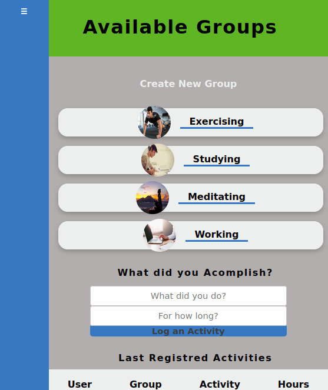

# Group our transations.
This project is a simple app built using basic Ruby on Rails functionalities in this app you can create an account, and when logged in, you will be able to  build groups and routines and keep track of them.

### Presentation on video
[Video](https://agile-depths-52362.herokuapp.com/)
### Built with
- Ruby v2.7.0
- Ruby on Rails 6.0.3.4
- Live demo link
### Live demo version
[live demo link](https://agile-depths-52362.herokuapp.com/)
## How to use the app
For you to try the app locally you can follow the next steps.
### Prerequisites
- Ruby: 2.7.1
- Rails: 6.0.0 
- Postgres: >=9.5
### To get a local copy up and running follow these simple example steps.
- Go to the main page of the repo.
- Press the "Code" button and get the repo link.
- Then run `git clone https://github.com/SigmaSam/Activity_Tracker.git` in your console to download the project
### set-up
- Install all gems by running  `bundle install `
- Create the database using `rails db:create `
- Migrate the database with `rails db:migrate `
- Run the seed with `rails db:seed`
### Using the app
Once you have set-up the app you are ready to use it.
- Run the server on your terminal with the command `rails server` by default the port is gonna be 3000 but if that port is not available you can run the server on a different port using `rails server -p 4001` where 4001 represents the port you choose.
- After the server is up and running open your browser and go to `http://localhost:3000/`( if you changed the port number also changed it on the url.)
### Testing the app with RSpec
You can run just by typing `rspec` in your console, take into consideration that the pre-loaded tests were created by a Microverse student, feel free to write your own tests.

## Author
Samuel Almao Herrera
- [Github](https://github.com/SigmaSam)

## 🤝 Contributing

Contributions, issues and feature requests are welcome!

Feel free to check the [issues page](issues/).

## Show your support

Give a ⭐️ if you like this project!

## Credits

📄💻 Layouts design by <a href="https://www.behance.net/gregoirevella" target="_blank">Gregoire Vella</a>
